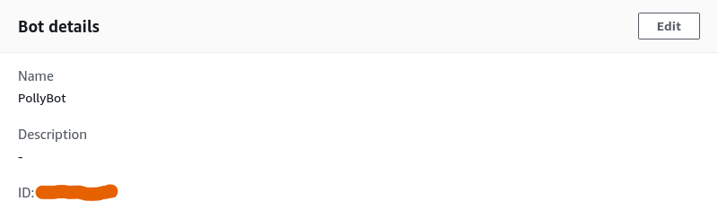
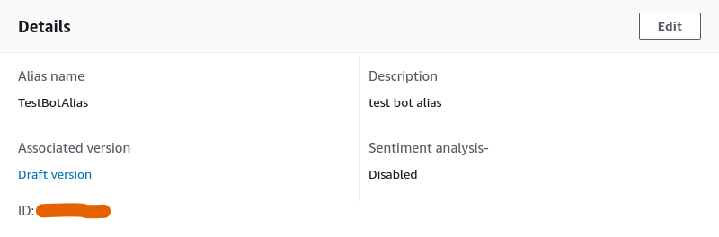

# PollyBot

### Instalação e Configuração

1. **Clone o repositório:**
   ```bash
   git clone https://github.com/Compass-pb-aws-2024-JULHO-A/sprint-8-pb-aws-julho-a.git
   cd sprint-8-pb-aws-julho-a
   ```

2. **Instale o Serverless Framework:**
   ```bash
   npm install -g serverless
   ```

3. **Instale o AWS CLI v2:**
   - **Windows**:
     ```bash
     msiexec.exe /i https://awscli.amazonaws.com/AWSCLIV2.msi
     ```
   - **Linux**:
     ```bash
     curl "https://awscli.amazonaws.com/awscli-exe-linux-x86_64.zip" -o "awscliv2.zip"
     unzip awscliv2.zip
     sudo ./aws/install
     ```

4. **Configure as credenciais da AWS:**
   ```bash
   aws configure sso
   ```

5. Instale as dependências.
    ```bash
    pip install -r requirements.txt
    npm install
    ```

6. Crie um arquivo `.env` seguindo o modelo do `.env.example`.
    - Onde encontrar o BOT_ID:
    
    - Onde encontrar o BOT_ALIAS_ID:
    

7. Dentro do diretório do arquivo `serverless.yml`, execute o comando `sls deploy`.

8. Execute o comando a seguir para acionar o Webhook do Telegram:
    ```bash
    curl -X POST "https://api.telegram.org/bot<TOKEN DO BOT>/setWebhook?url=<ENDPOINT GERADO PELO SERVERLESS>"
    ```